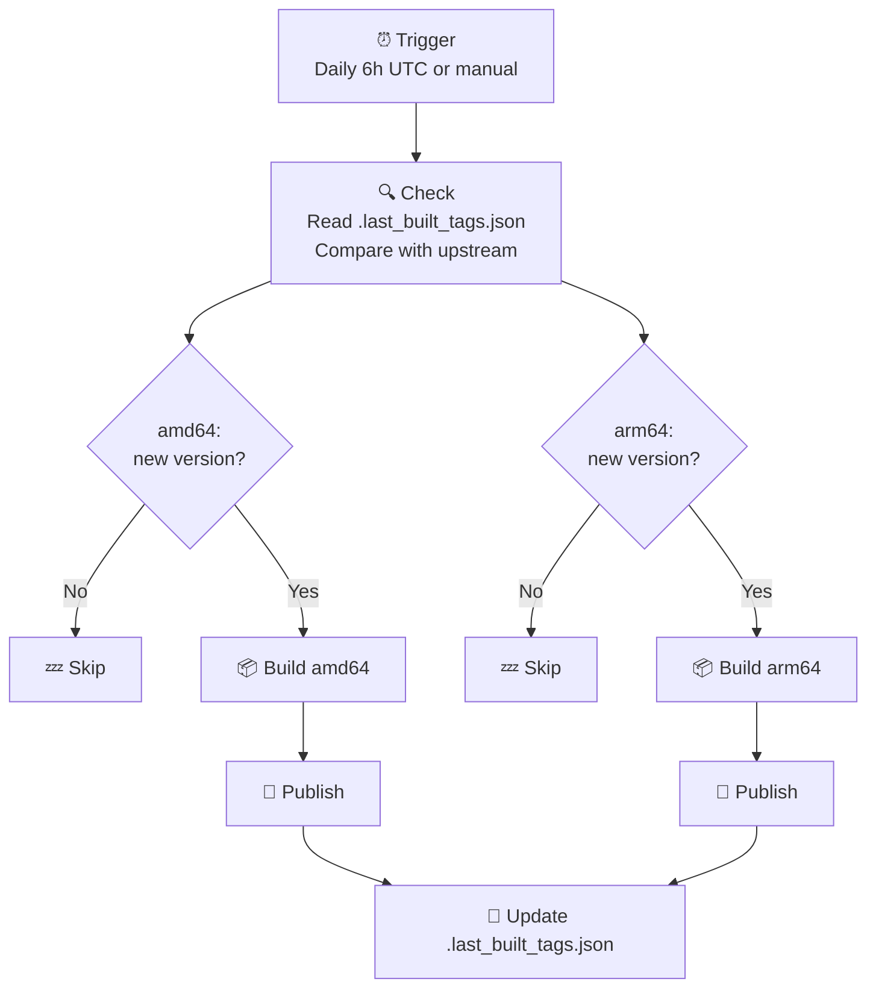
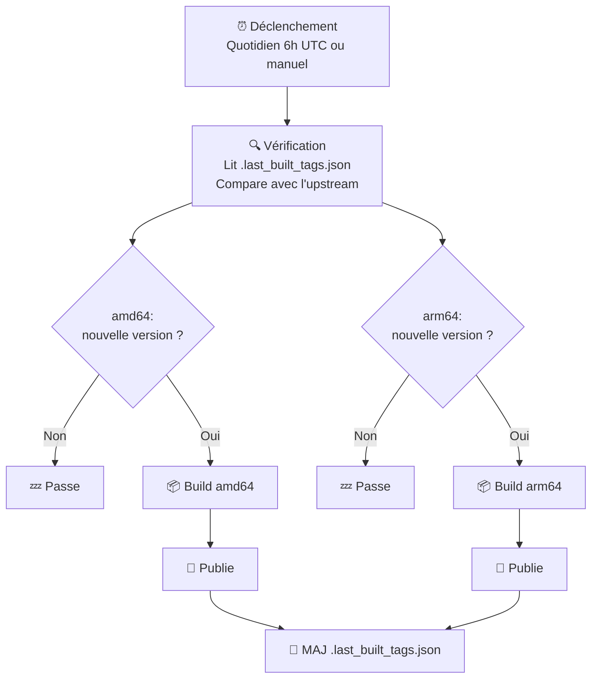

# 🎮 Ares Snap Builder

**[English](#english) | [Français](#français)**

---

<a name="english"></a>
## 🇬🇧 English

### What is this?

This repository automatically builds and publishes [Snap packages](https://snapcraft.io/) for [Ares](https://ares-emu.net/), a multi-system emulator focusing on accuracy and preservation.

**This project is also designed as a learning resource.** All configuration files are extensively commented (in English and French) to help you understand not just *what* each part does, but *why* it's configured that way.

### 📁 Repository Structure

```
ares-snap/
├── .github/
│   └── workflows/
│       └── build.yml            # GitHub Actions workflow
├── snap/
│   └── snapcraft.yaml           # Snap package definition
├── .last_built_tags.json        # Version tracking (auto-updated by CI)
├── deps.json                    # Prebuilt dependencies config
└── README.md
```

| File | Role |
|------|------|
| `build.yml` | Orchestrates the entire build process: version detection, source cloning, multi-architecture building, and publishing to the Snap Store. |
| `snapcraft.yaml` | Defines the Snap package itself: metadata, permissions, dependencies, build instructions, and desktop integration. The version field is a placeholder that gets replaced by the CI. |
| `deps.json` | Configuration for prebuilt dependencies (SDL, librashader, etc.) downloaded from [ares-deps](https://github.com/ares-emulator/ares-deps). Includes version and SHA256 hashes for integrity verification. |
| `.last_built_tags.json` | Tracks the last successfully built version for each architecture. Auto-committed by the CI after each build. |

### 🔄 How It Works



**Step by step:**

1. **Trigger** — The workflow runs daily at 6:00 UTC, or manually via the Actions tab
2. **Version check** — A single job queries upstream once and reads `.last_built_tags.json` to decide which architectures need building
3. **Build** — Each architecture builds in parallel on its native runner (clones source, downloads prebuilt deps, builds natively)
4. **Publish** — Uploads to the Snap Store (fails gracefully if name not yet registered)
5. **Track** — A final job commits the updated `.last_built_tags.json` with the new tag for each architecture that built successfully

### ⚙️ Configuration Explained

#### Tracking File: `.last_built_tags.json`

**What:** A JSON file at the repo root that stores the last successfully built version tag for each architecture (e.g., `{"amd64": "v147", "arm64": "v147"}`).

**Why:** GitHub Actions workflows are stateless — they don't remember anything between runs. To avoid rebuilding the same version every day, we need to persist the last built tag somewhere. We use a committed file rather than repository variables because GitHub's `GITHUB_TOKEN` cannot write repository variables (HTTP 403 error). A committed file works with the standard `GITHUB_TOKEN` and `contents: write` permission — no Personal Access Token needed!

**Setup:** Create `.last_built_tags.json` at the repo root with initial content:
```json
{"amd64": "", "arm64": ""}
```
The first workflow run will detect that both architectures need building and will automatically update the file after a successful build.

#### GitHub Secret: `SNAPCRAFT_TOKEN`

**What:** An authentication token that allows the workflow to publish to the Snap Store.

**Why:** Publishing to the Snap Store requires authentication with your Ubuntu One account. This token is generated locally and stored as a GitHub secret.

**Setup:**
```bash
# Install Snapcraft
sudo snap install snapcraft --classic

# Login (opens browser for Ubuntu One authentication)
snapcraft login

# Export credentials to a file
snapcraft export-login snapcraft.login

# Display the token — copy everything to GitHub Secrets
cat snapcraft.login

# Delete the file (security)
rm snapcraft.login
```

Then add this as a secret named `SNAPCRAFT_TOKEN` in **Settings > Secrets and variables > Actions > Secrets**.

#### Workflow Permissions: Read and Write

**What:** In **Settings > Actions > General > Workflow permissions**, select "Read and write permissions".

**Why:** By default, the `GITHUB_TOKEN` provided to workflows is read-only. We need write access so the workflow can commit the updated `.last_built_tags.json` tracking file after each successful build. The workflow declares `contents: write` permission explicitly.

### 🏗️ Native Multi-Architecture Build

The workflow builds natively on dedicated runners for each architecture:

| Architecture | Runner | Description |
|--------------|--------|-------------|
| `amd64` | `ubuntu-latest` | Intel/AMD 64-bit (most desktop/laptop PCs) |
| `arm64` | `ubuntu-24.04-arm` | ARM 64-bit (Raspberry Pi 4/5, Apple Silicon Linux VMs) |

**Why native builds?**
- **Speed** — No QEMU emulation overhead
- **Reliability** — Native compilation is more stable than emulation
- **Prebuilt deps** — Dependencies are downloaded from [ares-deps](https://github.com/ares-emulator/ares-deps), not compiled during the snap build

### 🚀 Manual Build

1. Go to **Actions** tab
2. Select **"Build Ares Snap"**
3. Click **"Run workflow"**
4. Check **"Force build"** if you want to rebuild the current version

### 🎯 Adapt This for Your Own Project

This repository is designed as a template. To package a different application:

1. **Copy this repository structure**

2. **Modify `build.yml`:**
   - Update the upstream repository URL
   - Adjust the tag pattern if needed (we use `v*` but your project might use `release-*`, `version-*`, etc.)
   - Change artifact names

3. **Modify `snap/snapcraft.yaml`:**
   - Update all metadata (name, description, license, URLs)
   - Adjust build dependencies for your application
   - Configure appropriate plugs (permissions) — see comments in the file
   - Update desktop integration (icon, .desktop file)

4. **Setup your credentials:**
   - Create `.last_built_tags.json` at repo root (initial content: `{"amd64": "", "arm64": ""}`)
   - Generate and add your `SNAPCRAFT_TOKEN`
   - Enable workflow "Read and write permissions" in Settings > Actions > General
   - Register your Snap name on [snapcraft.io](https://snapcraft.io/register)

---

<a name="français"></a>
## 🇫🇷 Français

### C'est quoi ce projet ?

Ce dépôt construit et publie automatiquement des [paquets Snap](https://snapcraft.io/) pour [Ares](https://ares-emu.net/), un émulateur multi-systèmes axé sur la précision et la préservation.

**Ce projet est aussi conçu comme une ressource pédagogique.** Tous les fichiers de configuration sont abondamment commentés (en anglais et français) pour vous aider à comprendre non seulement *ce que* fait chaque partie, mais *pourquoi* elle est configurée ainsi.

### 📁 Structure du dépôt

```
ares-snap/
├── .github/
│   └── workflows/
│       └── build.yml            # Workflow GitHub Actions
├── snap/
│   └── snapcraft.yaml           # Définition du paquet Snap
├── .last_built_tags.json        # Suivi de version (auto-MAJ par le CI)
├── deps.json                    # Config des dépendances précompilées
└── README.md
```

| Fichier | Rôle |
|---------|------|
| `build.yml` | Orchestre tout le processus de build : détection de version, clonage du source, build multi-architecture, et publication sur le Snap Store. |
| `snapcraft.yaml` | Définit le paquet Snap lui-même : métadonnées, permissions, dépendances, instructions de build et intégration desktop. Le champ version est un placeholder remplacé par le CI. |
| `deps.json` | Configuration des dépendances précompilées (SDL, librashader, etc.) téléchargées depuis [ares-deps](https://github.com/ares-emulator/ares-deps). Inclut la version et les hashs SHA256 pour la vérification d'intégrité. |
| `.last_built_tags.json` | Suit la dernière version buildée avec succès pour chaque architecture. Auto-committé par le CI après chaque build. |

### 🔄 Comment ça marche



**Étape par étape :**

1. **Déclenchement** — Le workflow s'exécute tous les jours à 6h UTC, ou manuellement via l'onglet Actions
2. **Vérification de version** — Un seul job interroge l'upstream une fois et lit `.last_built_tags.json` pour décider quelles architectures doivent être buildées
3. **Build** — Chaque architecture build en parallèle sur son runner natif (clone le source, télécharge les deps précompilées, build nativement)
4. **Publication** — Upload sur le Snap Store (échoue gracieusement si le nom n'est pas encore enregistré)
5. **Suivi** — Un job final committe le fichier `.last_built_tags.json` mis à jour avec le nouveau tag pour chaque architecture buildée avec succès

### ⚙️ Configuration expliquée

#### Fichier de suivi : `.last_built_tags.json`

**Quoi :** Un fichier JSON à la racine du dépôt qui stocke le dernier tag de version buildé avec succès pour chaque architecture (ex: `{"amd64": "v147", "arm64": "v147"}`).

**Pourquoi :** Les workflows GitHub Actions sont sans état — ils ne se souviennent de rien entre les exécutions. Pour éviter de rebuilder la même version tous les jours, on doit persister le dernier tag buildé quelque part. On utilise un fichier committé plutôt que des variables de dépôt car le `GITHUB_TOKEN` de GitHub ne peut pas écrire les variables de dépôt (erreur HTTP 403). Un fichier committé fonctionne avec le `GITHUB_TOKEN` standard et la permission `contents: write` — pas besoin de Personal Access Token !

**Configuration :** Créez `.last_built_tags.json` à la racine du dépôt avec le contenu initial :
```json
{"amd64": "", "arm64": ""}
```
La première exécution détectera que les deux architectures doivent être buildées et mettra automatiquement à jour le fichier après un build réussi.

#### Secret GitHub : `SNAPCRAFT_TOKEN`

**Quoi :** Un token d'authentification qui permet au workflow de publier sur le Snap Store.

**Pourquoi :** La publication sur le Snap Store nécessite une authentification avec votre compte Ubuntu One. Ce token est généré localement et stocké comme secret GitHub.

**Configuration :**
```bash
# Installer Snapcraft
sudo snap install snapcraft --classic

# Se connecter (ouvre le navigateur pour l'authentification Ubuntu One)
snapcraft login

# Exporter les identifiants dans un fichier
snapcraft export-login snapcraft.login

# Afficher le token — copiez tout dans GitHub Secrets
cat snapcraft.login

# Supprimer le fichier (sécurité)
rm snapcraft.login
```

Puis ajoutez ceci comme secret nommé `SNAPCRAFT_TOKEN` dans **Settings > Secrets and variables > Actions > Secrets**.

#### Permissions du workflow : Lecture et écriture

**Quoi :** Dans **Settings > Actions > General > Workflow permissions**, sélectionnez "Read and write permissions".

**Pourquoi :** Par défaut, le `GITHUB_TOKEN` fourni aux workflows est en lecture seule. On a besoin de l'accès en écriture pour que le workflow puisse committer le fichier de suivi `.last_built_tags.json` mis à jour après chaque build réussi. Le workflow déclare explicitement la permission `contents: write`.

### 🏗️ Build natif multi-architecture

Le workflow build nativement sur des runners dédiés pour chaque architecture :

| Architecture | Runner | Description |
|--------------|--------|-------------|
| `amd64` | `ubuntu-latest` | Intel/AMD 64-bit (la plupart des PC desktop/laptop) |
| `arm64` | `ubuntu-24.04-arm` | ARM 64-bit (Raspberry Pi 4/5, VMs Linux Apple Silicon) |

**Pourquoi des builds natifs ?**
- **Vitesse** — Pas d'overhead d'émulation QEMU
- **Fiabilité** — La compilation native est plus stable que l'émulation
- **Deps précompilées** — Les dépendances sont téléchargées depuis [ares-deps](https://github.com/ares-emulator/ares-deps), pas compilées pendant le build snap

### 🚀 Build manuel

1. Allez dans l'onglet **Actions**
2. Sélectionnez **"Build Ares Snap"**
3. Cliquez sur **"Run workflow"**
4. Cochez **"Force build"** si vous voulez rebuilder la version actuelle

### 🎯 Adapter ce projet pour votre application

Ce dépôt est conçu comme un template. Pour packager une autre application :

1. **Copiez la structure de ce dépôt**

2. **Modifiez `build.yml` :**
   - Mettez à jour l'URL du dépôt upstream
   - Ajustez le pattern de tag si nécessaire (on utilise `v*` mais votre projet peut utiliser `release-*`, `version-*`, etc.)
   - Changez les noms d'artifacts

3. **Modifiez `snap/snapcraft.yaml` :**
   - Mettez à jour toutes les métadonnées (nom, description, licence, URLs)
   - Ajustez les dépendances de build pour votre application
   - Configurez les plugs appropriés (permissions) — voir les commentaires dans le fichier
   - Mettez à jour l'intégration desktop (icône, fichier .desktop)

4. **Configurez vos identifiants :**
   - Créez `.last_built_tags.json` à la racine du dépôt (contenu initial : `{"amd64": "", "arm64": ""}`)
   - Générez et ajoutez votre `SNAPCRAFT_TOKEN`
   - Activez les permissions "Read and write" dans Settings > Actions > General
   - Enregistrez le nom de votre Snap sur [snapcraft.io](https://snapcraft.io/register)

---

## 📜 License

This project is open source and provided as a learning resource for the community.

Ares emulator is licensed under the [ISC License](https://github.com/ares-emulator/ares/blob/master/LICENSE).

---

## 🙏 Credits

- [Ares Emulator](https://ares-emu.net/) — The amazing multi-system emulator
- [Snapcraft](https://snapcraft.io/) — Universal Linux packaging
- [Launchpad](https://launchpad.net/) — Canonical's build infrastructure

---

*Made with ❤️ for the emulation and open source community*
